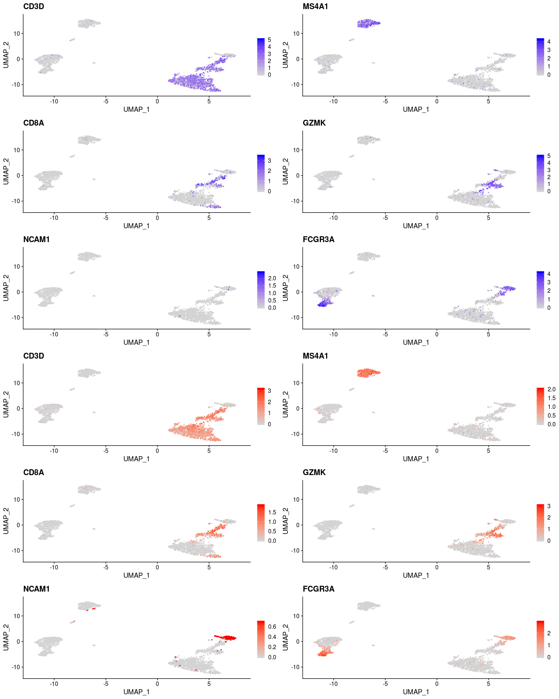

Zero-preserving imputation with ALRA
================
Compiled: July 13, 2019

This vigettte demonstrates how to run ALRA on Seurat objects, which aims to recover missing values in scRNA-seq data through imputation. If you use ALRA, please cite:

> *Zero-preserving imputation of scRNA-seq data using low-rank approximation*
>
> George C. Linderman, Jun Zhao, Yuval Kluger
>
> biorxiv, 2018.
>
> doi: <https://doi.org/10.1101/397588>
>
> GitHub: <https://github.com/KlugerLab/ALRA>

Prerequisites to install:

-   [Seurat](https://satijalab.org/seurat/install)
-   [SeuratWrappers](https://github.com/satijalab/seurat.wrappers)
-   [SeuratData](https://github.com/satijalab/seurat-data)

``` r
library(Seurat)
library(SeuratData)
library(SeuratWrappers)
library(dplyr)
```

### scRNA-seq imputation on pbmc3k

To learn more about this dataset, type `?pbmc3k`

``` r
InstallData("pbmc3k")
data("pbmc3k")
# Initial processing and visualization
pbmc3k <- SCTransform(pbmc3k) %>% RunPCA() %>% RunUMAP(dims = 1:30)
# run ALRA, creates alra assay of imputed values
pbmc3k <- RunALRA(pbmc3k)
```

<!-- out.height = 8, fig.height = 20, fig.width = 16 -->
``` r
# visualize original and imputed values
pbmc3k <- NormalizeData(pbmc3k, assay = "RNA")
features.plot <- c("CD3D", "MS4A1", "CD8A", "GZMK", "NCAM1", "FCGR3A")
DefaultAssay(pbmc3k) <- "RNA"
plot1 <- FeaturePlot(pbmc3k, features.plot, ncol = 2)
DefaultAssay(pbmc3k) <- "alra"
plot2 <- FeaturePlot(pbmc3k, features.plot, ncol = 2, cols = c("lightgrey", "red"))
CombinePlots(list(plot1, plot2), ncol = 1)
```


