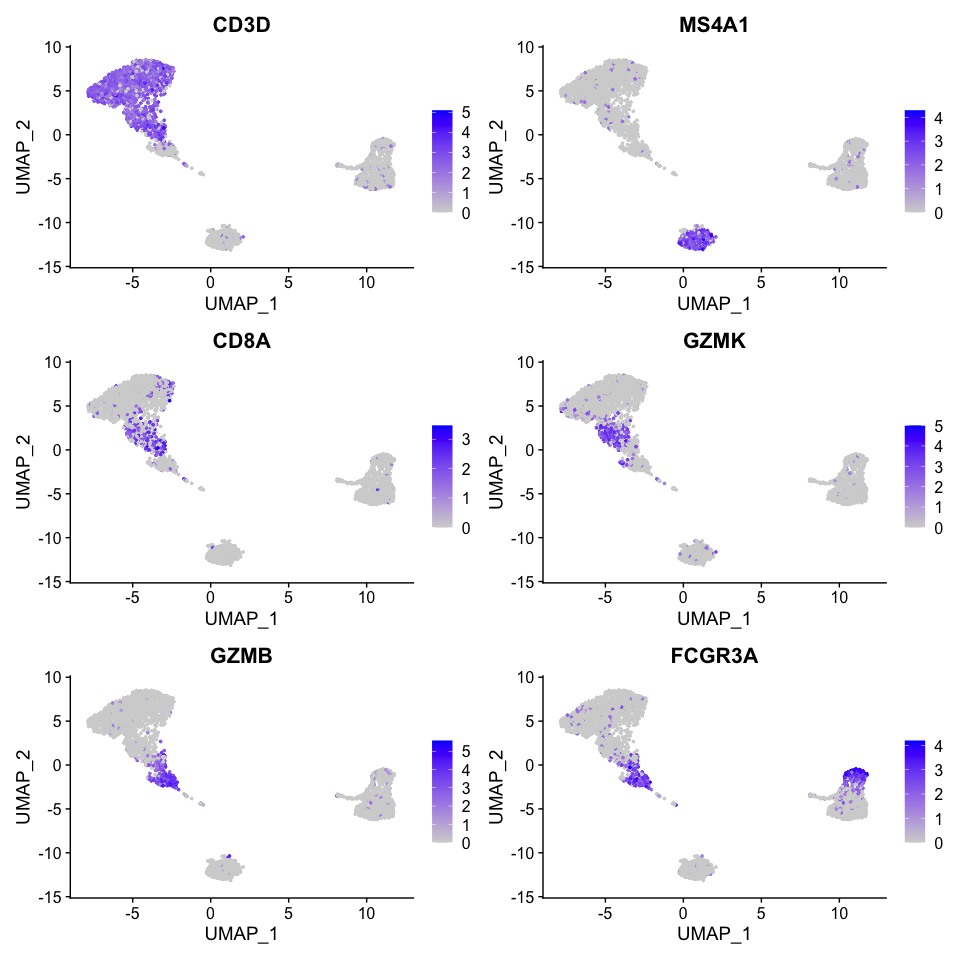

Running GLM-PCA on a Seurat Object
================
Compiled: May 01, 2020

This vigettte demonstrates how to run GLM-PCA, which implements a generalized version of PCA for non-normally distributed data, on a Seurat object. If you use this, please cite:

> *Feature selection and dimension reduction for single-cell RNA-Seq based on a multinomial model*
>
> F. William Townes, Stephanie C. Hicks, Martin J. Aryee & Rafael A. Irizarry
>
> Genome Biology, 2019
>
> doi: <https://doi.org/10.1186/s13059-019-1861-6>
>
> GitHub: <https://github.com/willtownes/glmpca> CRAN: <https://cran.r-project.org/web/packages/glmpca/index.html>

Prerequisites to install:

-   [Seurat](https://satijalab.org/seurat/install)
-   [SeuratWrappers](https://github.com/satijalab/seurat-wrappers)
-   [SeuratData](https://github.com/satijalab/seurat-data)
-   [glmpca](https://github.com/willtownes/glmpca)

``` r
library(Seurat)
library(SeuratData)
library(SeuratWrappers)
library(glmpca)
library(dplyr)
```

### GLM-PCA on PBMC3k

To learn more about this dataset, type `?pbmc3k`

``` r
InstallData("pbmc3k")
data("pbmc3k")

# Initial processing to select variable features 
pbmc3k <- NormalizeData(pbmc3k, verbose = FALSE) %>% FindVariableFeatures(verbose = FALSE)

# run GLM-PCA on Seurat object. 
# Uses Poisson model by default
# Note that data in the counts slot is used
# We choose 10 dimensions for computational efficiency

ndims <- 10
pbmc3k <- RunGLMPCA(pbmc3k, features = VariableFeatures(pbmc3k), L = ndims)
pbmc3k <- FindNeighbors(pbmc3k, reduction = 'glmpca', dims = 1:ndims, verbose = FALSE) %>% FindClusters(verbose = F)
pbmc3k <- RunUMAP(pbmc3k, reduction = 'glmpca', dims = 1:ndims, verbose = FALSE)
```

``` r
# visualize markers
features.plot <- c('CD3D', 'MS4A1', 'CD8A', 'GZMK', 'GZMB', 'FCGR3A')
DimPlot(pbmc3k)
```


``` r
FeaturePlot(pbmc3k, features.plot, ncol = 2)
```


